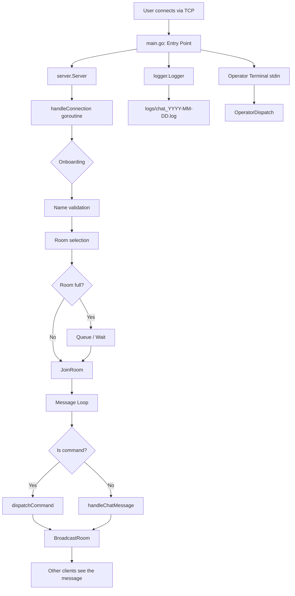

# Lesson 00: Overview

## Your Goal

You've been working with AI to build this TCP chat server. Now it's time to truly understand what you built — so you can maintain, debug, and extend it on your own. By the end of these lessons, you'll be able to navigate any part of this codebase without asking an AI for help.

---

## What is Code? (If You're New)

Think of code as a **recipe**: you have *ingredients* (data) and *instructions* (logic). The computer follows the instructions step-by-step, transforming the ingredients into a finished product.

Here are the 5 building blocks you'll see everywhere:

| Building Block   | Plain English               | Go Example                          |
|------------------|-----------------------------|-------------------------------------|
| Variable         | A labeled box holding data  | `port := "8989"`                    |
| Function         | A reusable recipe           | `func isValidPort(s string) bool`   |
| Condition        | A yes/no question           | `if len(os.Args) > 2 { ... }`      |
| Loop             | Repeat until done           | `for scanner.Scan() { ... }`       |
| Data Structure   | An organized container      | `map[string]*client.Client`         |

Everything in this codebase — no matter how complex — is built from these five pieces.

---

## What This Project Does (One Sentence)

**net-cat is a multi-room TCP chat server** that lets users connect via `netcat` (or any TCP client), pick a username and room, send messages, and be moderated by admins — all without any external dependencies.

---

## High-Level Architecture



---

## Directory Responsibilities

```
net-cat/
├── main.go              → Program entry point. Parses port, wires together server + logger + signals.
├── main_test.go         → Tests for port validation.
│
├── client/              → The "person on the other end of the wire."
│   ├── client.go        → Client struct: wraps a TCP connection with a write goroutine,
│   │                      handles echo mode, buffered input, and thread-safe state.
│   └── client_test.go   → Unit tests for Client behavior.
│
├── cmd/                 → The "dictionary of commands." Pure data, no I/O.
│   ├── commands.go      → Command registry (15 commands), privilege levels, parser.
│   └── commands_test.go → Tests for command parsing.
│
├── models/              → The "language" of the chat system. Pure data + formatting.
│   ├── message.go       → Message struct, 7 message types, Display(), FormatLogLine(), ParseLogLine().
│   └── message_test.go  → Tests for message formatting and round-trip log parsing.
│
├── logger/              → The "historian." Writes events to daily rotating log files.
│   ├── logger.go        → Thread-safe file logger with automatic date-based rotation.
│   └── logger_test.go   → Tests including concurrent writes and day-boundary rotation.
│
├── server/              → The "brain." Manages everything: connections, rooms, moderation, admin.
│   ├── server.go        → Server struct, New(), Start(), Shutdown(), heartbeat, midnight watcher.
│   ├── handler.go       → Per-connection lifecycle: onboarding → room selection → message loop.
│   ├── room.go          → Room struct, room CRUD, per-room broadcast, history, queue management.
│   ├── clients.go       → Global client map: Register, Remove, Rename, GetByIP.
│   ├── commands.go      → Client-facing /command handlers (/kick, /ban, /whisper, etc.).
│   ├── moderation.go    → IP-based kick cooldown and ban lists.
│   ├── admins.go        → Admin list persistence to admins.json (atomic file write).
│   ├── operator.go      → Server operator terminal: reads stdin, dispatches with full authority.
│   ├── history.go       → History clear, recovery from log file on startup.
│   ├── admins.json      → Persisted admin usernames (JSON array).
│   └── *_test.go        → Unit, integration, recovery, and stress tests.
│
├── logs/                → Generated at runtime. Daily log files live here.
│   └── chat_YYYY-MM-DD.log
│
├── go.mod               → Module definition. Go 1.25, zero external dependencies.
├── README.md            → User and operator documentation.
└── CHANGELOG.md         → Version history following semantic versioning.
```

---

## Entry and Exit Points

### Entry Point: `main.go:11`

```go
func main() {
    port := "8989"           // default port
    // ... arg validation ...
    srv := server.New(port)  // create the server
    l, _ := logger.New("logs")
    srv.Logger = l
    // signal handler for Ctrl+C
    go srv.StartOperator(os.Stdin) // operator terminal
    srv.Start()                     // BLOCKS here until shutdown
}
```

**What happens on `Start()`:**
1. Opens TCP listener on the port
2. Loads saved admins from `admins.json`
3. Recovers today's chat history from the log file
4. Starts a midnight watcher (resets history at day change)
5. Enters the accept loop — spawns a goroutine per new connection
6. Blocks until `Shutdown()` is called

### Exit Point: `server.go:100` — `Shutdown()`

1. Closes the TCP listener (stops new connections)
2. Sends "Goodbye" to all tracked connections
3. Waits up to 5 seconds for clients to disconnect
4. Force-closes remaining connections
5. Logs the shutdown event
6. Closes the logger

---

## What's Next

In the next lesson, you'll learn the **core concepts** used throughout this codebase — goroutines, channels, mutexes, and more — explained from scratch.
