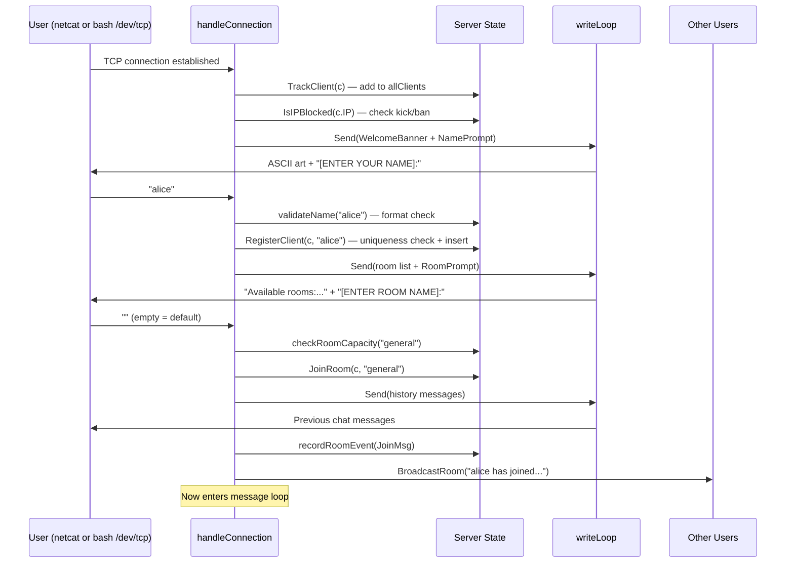
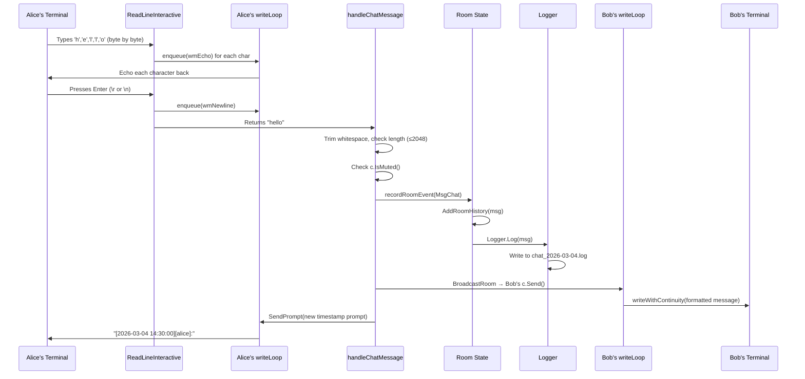
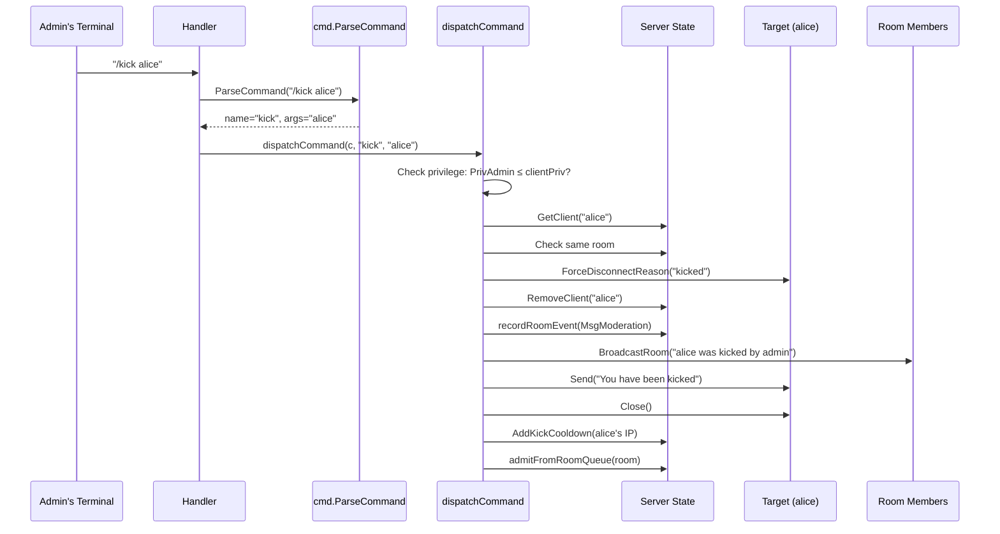
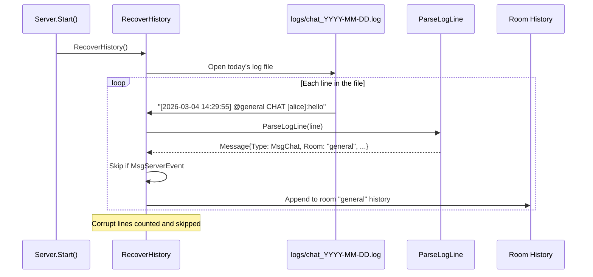

# Lesson 02: Data Flow

## The Factory Assembly Line

Think of this chat server like a **factory with multiple assembly lines running in parallel**:

1. **Raw materials arrive** — a user types characters on their keyboard
2. **Quality control** — the server validates the input (is it a command? is the user muted?)
3. **Processing** — the message is formatted, stored in history, and written to the log file
4. **Distribution** — the formatted message is sent to every other user in the room
5. **Display** — each user's terminal shows the message without disrupting what they're typing

---

## How to Read These Diagrams

- **Boxes** `[ ]` = things (data, components, files)
- **Arrows** `→` = movement or transformation
- **Labels** on arrows = what's happening at that step
- **Vertical lines** `|` in sequence diagrams = the passage of time

---

## Flow 1: A User Connects and Joins

> **Connection methods:** The user connects via `nc localhost 8989` (netcat) or bash's built-in `exec 3<>/dev/tcp/localhost/8989; cat <&3 & cat >&3`. Either way, the server sees the same thing: an incoming TCP connection.



### The Story in Plain English

1. A TCP connection arrives. The server wraps it in a `Client` struct and tracks it.
2. Before anything else, the server checks if this IP is banned or recently kicked.
3. The welcome banner (ASCII art penguin) and name prompt are sent.
4. The user types a name. The server validates it (no spaces, printable ASCII, 1-32 chars).
5. The server checks if the name is unique and not reserved ("Server").
6. The user picks a room. Empty input means "general" (the default).
7. If the room is full (10 users), the server offers a queue position.
8. Once in the room, the server replays the room's chat history.
9. A join notification is broadcast to everyone else in the room.
10. The heartbeat goroutine starts, probing the connection every 10 seconds.

---

## Flow 2: A Chat Message

This is the most common flow — what happens when Alice types "hello" in the chat.



### The Story in Plain English

1. Alice types each character one at a time (byte-by-byte reading in echo mode).
2. Each character is echoed back to her terminal through the writeLoop channel.
3. When she presses Enter, `ReadLineInteractive` returns the complete line `"hello"`.
4. `handleChatMessage` checks: is the message empty? Too long (>2048 chars)? Is she muted?
5. The message is wrapped in a `Message` struct with timestamp, sender, content, and type.
6. `recordRoomEvent` does two things atomically:
   - Appends the message to the room's in-memory history (for new joiners)
   - Writes the formatted log line to `logs/chat_2026-03-04.log`
7. `BroadcastRoom` sends the formatted message to every client in the room except Alice.
8. Bob's `writeLoop` receives the message and uses `writeWithContinuity` to display it without disrupting what Bob is currently typing.
9. Alice gets a new prompt with the current timestamp.

---

## Flow 3: Echo Mode (Input Continuity)

> **Note on bash `/dev/tcp` connections:** The echo mode and input continuity described below work best with netcat, which sends each keystroke immediately. With the bash `cat >&3` approach, input is line-buffered by the shell — characters aren't sent until you press Enter. The server still activates echo mode, but the user doesn't see real-time echo because the data hasn't arrived yet. Once Enter is pressed, the whole line arrives at once.

This is the trickiest part of the system. When Bob is mid-sentence and Alice's message arrives, Bob's terminal needs to:

```
BEFORE (Bob is typing "how ar"):
[2026-03-04 14:30:00][bob]:how ar

ALICE'S MESSAGE ARRIVES:
[2026-03-04 14:29:55][alice]:hello     ← Alice's message appears
[2026-03-04 14:30:00][bob]:how ar      ← Bob's partial input is PRESERVED

BOB FINISHES TYPING "how are you":
[2026-03-04 14:30:05][bob]:how are you ← Completed and sent
```

### Data Transformations (Step by Step)

```
STEP 1: Bob's writeLoop state
  prompt   = "[2026-03-04 14:30:00][bob]:"
  inputBuf = ['h','o','w',' ','a','r']

STEP 2: Alice's message arrives via BroadcastRoom
  msg = "[2026-03-04 14:29:55][alice]:hello\n"

STEP 3: writeWithContinuity builds ONE buffer
  \r            ← Move cursor to start of line
  \033[K        ← ANSI escape: erase from cursor to end of line
  [message]     ← Alice's formatted message
  [prompt]      ← Bob's prompt string
  [inputBuf]    ← Bob's partial input "how ar"

STEP 4: Single Conn.Write() sends the entire buffer
  Result on Bob's screen:
  [2026-03-04 14:29:55][alice]:hello
  [2026-03-04 14:30:00][bob]:how ar    ← cursor is here, Bob keeps typing
```

**Key Insight:** The entire output is assembled into a single byte buffer and written with one `Conn.Write` call. This prevents partial writes from appearing on screen — the user never sees a "glitched" half-update.

---

## Flow 4: A Command (e.g., `/kick alice`)



### The Story in Plain English

1. The admin types `/kick alice` — the leading `/` marks it as a command.
2. `cmd.ParseCommand` splits it: command name = `"kick"`, arguments = `"alice"`.
3. `dispatchCommand` looks up `/kick` in the command registry: it requires `PrivAdmin`.
4. The admin's privilege level is checked. Admins pass; regular users get "Insufficient privileges."
5. The target user is looked up in the global client map.
6. The target's disconnect reason is set to `"kicked"` (so the deferred cleanup knows not to double-broadcast).
7. The target is removed from the client map and room.
8. A moderation event is logged and broadcast to the room.
9. The target receives "You have been kicked" and their connection is closed.
10. The target's IP gets a 5-minute reconnection cooldown.
11. If anyone was queued for this room, the first queued user is admitted.

---

## Flow 5: Crash Recovery on Startup



### Data Transformations (Step by Step)

```
STEP 1: Raw log line from file
  "[2026-03-04 14:29:55] @general CHAT [alice]:hello"

STEP 2: After ParseLogLine()
  Message{
    Timestamp: 2026-03-04 14:29:55
    Type:      MsgChat (0)
    Sender:    "alice"
    Content:   "hello"
    Room:      "general"
  }

STEP 3: Routed to room "general"'s history slice
  rooms["general"].history = append(history, msg)

STEP 4: When Bob connects later, he sees
  "[2026-03-04 14:29:55][alice]:hello"
  (rendered by msg.Display())
```

**Key Insight:** The log format is a **bidirectional codec**. `FormatLogLine()` serializes a `Message` to a string, and `ParseLogLine()` deserializes it back. This means the log file is not just for humans — it's the crash-recovery database.

---

## Flow 6: The Write Pipeline (Why Messages Never Block)

```
                    ┌──────────────────────────────────────────┐
                    │         Multiple goroutines              │
                    │  (handler, broadcast, heartbeat, etc.)   │
                    └─────────────┬────────────────────────────┘
                                  │ c.Send(msg)
                                  │ c.SendPrompt(prompt)
                                  ▼
                    ┌──────────────────────────┐
                    │    enqueue() function     │
                    │  Non-blocking select:     │
                    │  • Send to channel OR     │
                    │  • Drop if full (4096)    │
                    │  • Skip if client closed  │
                    └────────────┬─────────────┘
                                 │
                                 ▼
                    ┌──────────────────────────┐
                    │  msgChan (buffered 4096)  │
                    │  ═══════════════════════  │
                    │  msg1 | msg2 | msg3 | ... │
                    └────────────┬─────────────┘
                                 │
                                 ▼
                    ┌──────────────────────────┐
                    │    writeLoop goroutine    │
                    │    (SOLE Conn writer)     │
                    │                          │
                    │  Reads one message at a   │
                    │  time and writes to the   │
                    │  TCP connection.          │
                    └────────────┬─────────────┘
                                 │
                                 ▼
                    ┌──────────────────────────┐
                    │      TCP Connection      │
                    │   → User's terminal      │
                    └──────────────────────────┘
```

**Why this design matters:**
- A slow client (bad network, unresponsive terminal) can't slow down the server or other clients
- The 4096-message buffer absorbs bursts
- If the buffer fills up (extremely unlikely), messages are dropped for that one client only
- The server never blocks on a `Send()` call

---

## Summary: Where Data Lives

| Data | Lives In | Protected By | Persisted? |
|------|----------|-------------|------------|
| Active clients | `server.clients` map | `server.mu` | No |
| Room membership | `room.clients` map | `server.mu` | No |
| Chat history | `room.history` slice | `server.mu` | Yes (log file) |
| Admin list | `server.admins` map | `server.mu` | Yes (`admins.json`) |
| Banned IPs | `server.bannedIPs` map | `server.mu` | No (session only) |
| Kick cooldowns | `server.kickedIPs` map | `server.mu` | No (5-min expiry) |
| Log entries | `logs/chat_YYYY-MM-DD.log` | `logger.mu` | Yes |
| Partial user input | `client.inputBuf` | writeLoop only | No |

---

## What's Next

In the next lesson, you'll learn about the **design patterns** used throughout the codebase — reusable solutions to recurring problems.
